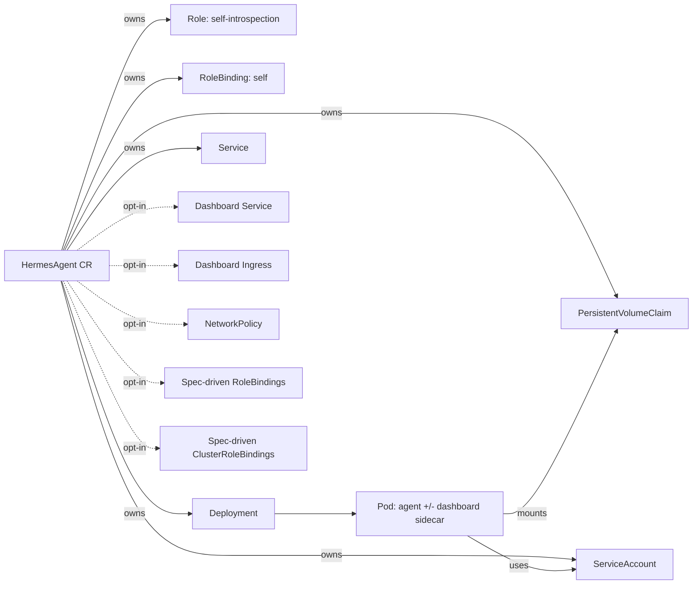

# How a HermesAgent runs in your cluster

This page explains what objects the operator creates when you apply a single `HermesAgent` CR, so you can map what you see with `kubectl get` back to what you wrote in YAML.

## Resources created per CR



Solid arrows are always created. Dotted arrows are gated by an opt-in field on the CR spec.

### Always created

- **PersistentVolumeClaim** `hermes-<name>`: shape from `spec.storage.persistentVolumeClaim`. By default the PVC has no owner reference back to the CR, so deleting the CR leaves your data in place. See [PVC sovereignty](storage.md).
- **ServiceAccount** `hermes-<name>`: the identity the agent Pod runs as. Use `spec.serviceAccountName` to point at a SA you already manage.
- **Role + RoleBinding** `hermes-<name>-self`: a narrow self-introspection grant so the agent can read its own spec/status and `kubectl rollout restart` itself from inside the pod. See [The RBAC model](rbac-model.md).
- **Deployment** `hermes-<name>`: `replicas: 1`, `strategy: Recreate`, an exec readiness probe, and `terminationGracePeriodSeconds: 210`. The env is composed from `spec.llmProviders[].env`, `spec.gateways[].env`, `spec.env`, and a small set of operator-stamped identity vars.
- **Service** `hermes-<name>`: a ClusterIP handle for the agent.

### Opt-in (set a field on the CR to enable)

- **Dashboard Service + optional Ingress**: when `spec.dashboard.enabled: true`. Adds a `dashboard` sidecar container to the Pod (with `shareProcessNamespace: true`) and a `hermes-<name>-dashboard` Service on port 9119. See [Enable the dashboard sidecar](../how-to/enable-dashboard.md).
- **NetworkPolicy**: when `spec.networkPolicy.enabled: true`. Direct passthrough of `spec.networkPolicy.{ingress,egress,policyTypes}` onto a `networking.k8s.io/v1` NetworkPolicy. See [Restrict agent network traffic](../how-to/network-policy.md).
- **Spec-driven RoleBindings / ClusterRoleBindings**: when `spec.rbac.roleBindings[]` or `spec.rbac.clusterRoleBindings[]` is populated. Reference-only: the operator creates bindings, never roles. ClusterRoleBindings are gated by an install-time allowlist.

## Validation at admission time

The CRD ships OpenAPI schema rules plus `x-kubernetes-validations` CEL expressions that the API server enforces on every `kubectl apply`. The operator is not in the path. Invalid CRs are rejected synchronously with a field-pathed error before they reach etcd.

What is checked:

- `spec.image` must be set (`MinLength: 1`).
- `spec.llmDefaultProvider`, when set, must match an entry in `spec.llmProviders[].name`.
- `spec.gateways[].type` and `spec.llmProviders[].name` must be non-empty.
- A few cross-field configuration shapes (e.g. `spec.networkPolicy.enabled: true` with no rules at all is rejected as almost-certainly-a-mistake).

Some advisory checks (e.g. "did you remember to set auth annotations on the Ingress?") cannot be expressed in CRD validation alone and live as docs guidance. See [Expose the dashboard externally](../how-to/expose-dashboard.md).

## Readiness signal

The agent container's readiness is an exec probe:

```
hermes gateway status | grep -q '✓ Gateway is running'
```

`hermes gateway run` does not bind an HTTP server, so an HTTP probe is not an option without the dashboard sidecar. The exec probe uses the absolute path `/opt/hermes/.venv/bin/hermes`, which works regardless of `$PATH`. The probe drives `status.podReady`, and the Deployment controller's pod-readiness signal feeds `status.phase`.

When `spec.dashboard.enabled: true`, the operator additionally polls the sidecar's `/api/status` every 30s to populate `status.gateways[]` with per-platform connection state.

## See also

- [PVC sovereignty](storage.md) — why your agent owns its state.
- [The RBAC model](rbac-model.md) — what the operator grants and what it deliberately does not.
- [Lifecycle, phases, and conditions](lifecycle.md) — how `status.phase` and `status.conditions[]` move over time.
- [Reference: HermesAgent API](../reference/api-reference.md) — every field documented.
